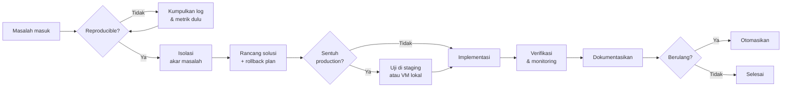

<div align="center">


<a href="https://hrace009.com">
  
</a>

<br/>


</div>

---

## `$ whoami`

```php
<?php

declare(strict_types=1);

final readonly class Harris
{
    public function __construct(
        public string $handle     = 'hrace009',
        public string $role       = 'Technical Assistant · Perusahaan Migas',
        public string $sideQuest  = 'Server engineer & community maintainer',
        public string $lokasi     = 'Pekanbaru, Riau, Indonesia',
        public string $timezone   = 'Asia/Jakarta (WIB, GMT+7)',
        public int    $pengalaman = 15, // tahun, dan masih ngitung
    ) {}

    /** Hal yang saya kerjakan tanpa perlu disuruh dua kali. */
    public function fokus(): array
    {
        return [
            'backend'  => ['Laravel 12', 'REST API', 'Queue & Job', 'Payment gateway'],
            'infra'    => ['Rocky Linux 9', 'NGINX', 'MariaDB', 'Hyper-V', 'GCP'],
            'native'   => ['C++', 'C#', 'Qt6', 'Lua'],
            'lowlevel' => ['Ghidra', 'IDA Pro', 'Binary format parsing'],
            'data'     => ['Power BI', 'SharePoint', 'Project information system'],
        ];
    }

    /** Aturan yang tidak pernah saya langgar. */
    public function prinsip(): array
    {
        return [
            'Jangan pernah tulis langsung ke database production — lewat API.',
            'Kalau dikerjakan lebih dari dua kali, otomasikan.',
            'Dokumentasi ditulis sekarang, bukan nanti.',
            'Rollback plan disiapkan sebelum deploy, bukan sesudah panik.',
        ];
    }
}
```

Singkatnya: saya betah di lapisan yang jarang dilihat orang — bagaimana service saling
bicara, bagaimana binary di-parse, bagaimana satu baris konfigurasi menentukan sistem
bertahan atau tumbang saat trafik naik.

---

## `$ cat stack.txt`

<div align="center">

**Bahasa & Framework**


**Infrastruktur & Database**


**Tools & Environment**


</div>

---

## `$ tree ~/expertise`

<details open>
<summary><b>⚙️ &nbsp;Backend Engineering</b></summary>

<br/>

| Area | Detail |
|---|---|
| **Arsitektur** | Service layer, repository pattern, DTO, action class, strict types |
| **API** | REST design, versioning, rate limiting, API resource & transformer |
| **Async** | Queue worker, job batching, scheduled task, retry & backoff strategy |
| **Auth** | Role & permission, token lifecycle, session hardening |
| **Payment** | QRIS, Virtual Account, PayPal — termasuk penanganan callback & idempotensi |

</details>

<details>
<summary><b>🖥️ &nbsp;Infrastruktur & Operasional</b></summary>

<br/>

| Area | Detail |
|---|---|
| **Provisioning** | Rocky Linux 9 dari bare install sampai siap produksi lewat script |
| **Web layer** | NGINX reverse proxy, TLS via Let's Encrypt, tuning worker & buffer |
| **Database** | MariaDB tuning, backup & restore, recovery dari korupsi tabel |
| **Virtualisasi** | Hyper-V, WSL 2 multi-instance, migrasi VMDK → VHDX |
| **Keamanan** | Fail2ban, SSH hardening, firewall policy, penanganan insiden brute-force |
| **Deployment** | Bash automation untuk patching, rollout bertahap, dan verifikasi pasca-deploy |

</details>

<details>
<summary><b>🎮 &nbsp;Game Server Development</b></summary>

<br/>

| Area | Detail |
|---|---|
| **Arsitektur emulator** | Delivery, link, game, database, auth, dan log service |
| **Data file** | Parsing format binary tertutup dan tabel konfigurasi game |
| **Scripting** | Lua untuk skill, quest, event, dan penyeimbangan class |
| **Client** | Patching C++, version check, batasan fitur, anti-cheat & HWID |
| **Tooling** | Aplikasi desktop Qt6 dan C# WinForms untuk editor data |

</details>

<details>
<summary><b>🔍 &nbsp;Reverse Engineering</b></summary>

<br/>

| Area | Detail |
|---|---|
| **Disassembly** | Ghidra, IDA Pro, Capstone untuk memetakan memory offset |
| **Hooking** | Detour, injeksi DLL, intersepsi fungsi runtime |
| **Analisis format** | Membedah struktur file tanpa dokumentasi resmi |
| **Debugging** | Menelusuri crash native sampai ke instruksi penyebabnya |

</details>

<details>
<summary><b>📊 &nbsp;Data & Reporting</b></summary>

<br/>

| Area | Detail |
|---|---|
| **Power BI** | Dashboard operasional, pemodelan data, relasi antar tabel |
| **SharePoint** | Struktur dokumen, kontrol versi, alur persetujuan |
| **Sistem proyek** | Sistem informasi manajemen proyek untuk kebutuhan lapangan |

</details>

---

## `$ ls -la ~/projects`

<details open>
<summary><b>🖥️ &nbsp;Server Infrastructure</b></summary>

<br/>

Provisioning dan hardening cluster **Rocky Linux 9** di cloud — dirancang menahan
ribuan koneksi simultan dengan jendela maintenance terjadwal dan rollback yang teruji.

`Rocky Linux 9` · `NGINX` · `Let's Encrypt` · `Fail2ban` · `Automated patching`

</details>

<details>
<summary><b>🧩 &nbsp;Web Panel Laravel</b></summary>

<br/>

Panel manajemen akun, pengguna, dan transaksi. Seluruh akses data melewati API —
tidak ada satu pun query yang menyentuh database secara langsung dari sisi panel.

`Laravel 12` · `Livewire` · `Tailwind` · `MariaDB` · `QRIS / VA / PayPal`

</details>

<details>
<summary><b>🤖 &nbsp;Discord Bot</b></summary>

<br/>

Bot Node.js dengan **discord.js v14**: status service, lookup data, account linking,
dan event logging — semuanya routing lewat Laravel API, bukan koneksi database langsung.

`Node.js` · `discord.js v14` · `REST integration`

</details>

<details>
<summary><b>🔩 &nbsp;Native & Client Engineering</b></summary>

<br/>

Patching aplikasi C++, Lua scripting untuk logika gameplay dan balancing, serta
aplikasi desktop Qt6 dengan penyimpanan kredensial terenkripsi AES-256.

`C++` · `Qt6` · `C#` · `Lua` · `AES-256`

</details>

<details>
<summary><b>🔍 &nbsp;Reverse Engineering</b></summary>

<br/>

Analisis binary menggunakan **Ghidra** dan **Capstone** untuk memetakan memory offset
serta membedah struktur file format tertutup yang tidak punya dokumentasi.

`Ghidra` · `IDA Pro` · `Capstone` · `Binary parsing`

</details>

<details>
<summary><b>💬 &nbsp;PSDevHub</b></summary>

<br/>

Forum dan knowledge base untuk developer berbahasa Indonesia — tempat menaruh solusi
yang biasanya cuma nyangkut di thread forum luar negeri dan hilang setahun kemudian.

[hrace009.com](https://hrace009.com)

</details>

---

## `$ cat workflow.md`

Cara saya menangani pekerjaan, dari masalah sampai selesai:



Prinsipnya sederhana: **jangan menebak di production**, dan **jangan menyelesaikan
masalah yang sama dua kali secara manual**.

---

## `$ neofetch`

```console
harris@homelab:~$ neofetch

        .-/+oossssoo+/-.          harris@homelab
    `:+ssssssssssssssssss+:`      ------------------------------------
  -+ssssssssssssssssssyyssss+-    Role .......... Technical Assistant
 /ssssssssssshdmmNNmmyNMMMMhssss/ Field ......... Oil & Gas · IT
+ssssssssshmydMMMMMMMNddddyssssss+Location ...... Pekanbaru, ID (WIB)
/sssssssshNMMMyhhyyyyhmNMMMNhssss/Experience .... 15+ tahun
.ssssssssdMMMNhsssssssshNMMMdssss.Daily OS ...... Windows + WSL 2
+sssshhhyNMMNyssssssssssyNMMMysss+Server OS ..... Rocky Linux 9
ossyNMMMNyMMhsssssssssssshmmmhssso Hypervisor ... Hyper-V
ossyNMMMNyMMhsssssssssssshmmmhssso Editor ....... VS Code · JetBrains
+sssshhhyNMMNyssssssssssyNMMMysss+ Shell ........ bash · PowerShell
.ssssssssdMMMNhsssssssshNMMMdssss. Database ..... MariaDB
/sssssssshNMMMyhhyyyyhdNMMMNhssss/ Web server ... NGINX
+sssssssssdmydMMMMMMMMddddyssssss+ Uptime ....... sejak lama, minus maintenance
/ssssssssssshdmNNNNmyNMMMMhssss/   
  -+sssssssssssssssssyyyssss+-     
    `:+ssssssssssssssssss+:`       
        .-/+oossssoo+/-.           
```

---

## `$ cat learning.md`

Yang sedang aktif saya dalami sekarang:

```text
Advanced Qt6 (QML + threading) ██████████████░░░░░░   70%
Workflow automation (n8n)      ████████████████░░░░   80%
Observability & tracing        ████████░░░░░░░░░░░░   40%
```

> Angka di atas versi jujur, bukan versi CV.

---

## `$ git log --stat`

<div align="center">


<br/>


<br/>


</div>

<!--
  CATATAN: widget di atas di-render oleh layanan pihak ketiga (Vercel).
  Kalau sering gagal muncul karena rate limit, ganti dengan versi
  self-hosted atau pakai hasil GitHub Actions di seksi berikutnya.
-->

---

## `$ ./snake.sh`

<div align="center">

<picture>
  <source media="(prefers-color-scheme: dark)" srcset="https://raw.githubusercontent.com/hrace009/hrace009/output/github-snake-dark.svg" />
  <source media="(prefers-color-scheme: light)" srcset="https://raw.githubusercontent.com/hrace009/hrace009/output/github-snake.svg" />
  
</picture>

</div>

---

## `$ uptime --offline`

```console
harris@homelab:~$ uptime --offline

  ⚫⚪  Juventus FC ............... Fino alla fine
  🎮  Perfect World PS .......... masih diotak-atik sampai sekarang
  🔁  n8n workflow .............. otomasi yang menolak dikerjakan manual
  🧪  Homelab ................... virtualisasi, jaringan, self-hosted semua
  ☕  Jam produktif ............. lewat tengah malam WIB
```

---

## `$ man harris`

<details>
<summary><b>Stack apa yang paling sering dipakai?</b></summary>

<br/>

Laravel untuk hampir semua kebutuhan web dan API, Rocky Linux 9 untuk server,
MariaDB untuk data, dan C++/Qt6 kalau urusannya sudah turun ke level native.

</details>

<details>
<summary><b>Kenapa selalu menolak query langsung ke database?</b></summary>

<br/>

Karena database bukan API. Begitu ada dua aplikasi menulis ke tabel yang sama
dengan asumsi berbeda, validasi dan audit trail langsung hilang — dan biasanya
baru ketahuan setelah data rusak. Semua lewat satu pintu: API.

</details>

<details>
<summary><b>Terbuka untuk kolaborasi?</b></summary>

<br/>

Ya, terutama untuk proyek Laravel, tooling infrastruktur, atau apa pun yang
melibatkan reverse engineering dan otomasi. Diskusi teknis selalu diterima.

</details>

<details>
<summary><b>Bahasa komunikasi?</b></summary>

<br/>

Bahasa Indonesia dan Inggris, keduanya nyaman. Istilah teknis biasanya
saya biarkan dalam bahasa Inggris supaya tidak ambigu.

</details>

---

<div align="center">

## `$ contact --list`

<a href="https://hrace009.com"></a>
<a href="https://github.com/hrace009"></a>

<br/><br/>

<sub>Terbuka untuk diskusi soal Laravel, infrastruktur Linux, dan server engineering.</sub>

<br/>

<sub><i>"Kalau bisa diotomasikan, kenapa dikerjakan manual dua kali?"</i></sub>


</div>